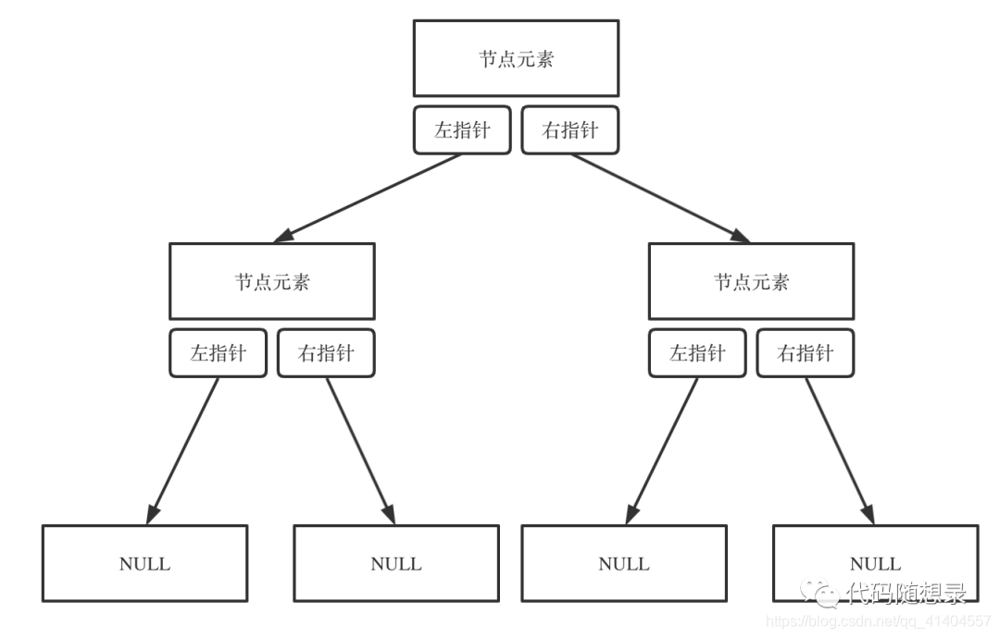
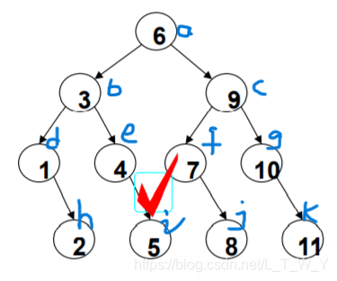

树是一种数据结构，它是由n（n>=1）个有限节点组成一个具有层次关系的集合。

二叉树是每个节点最多有两个子树的树结构。

#### **二叉树的性质**：

性质1：二叉树第i层上节点的数目最多为2^{i-1}

性质2：深度为k的二叉树至多有**2^{k}-1**个节点

性质3：包含n个节点的二叉树的高度至少为**log2 (n+1)** => 满二叉树存在最多节点

性质4：在任意一颗二叉树中，若终端节点的个数为**n0，**度为2的节点数为**n2**，则**n0=n2+1**
$$
proof:
\\设总节点个数为n,二叉树的边数为T,度为i的节点数为n_i
\\每插入一个节点都要多一条边，一个节点T=0，由等差数列 \Rightarrow T = n-1 
\\显然: n = n_0 + n_1 + n_2
\\对任意一个节点，每有一个度就多一条边 \Rightarrow T = 2n_2+n_1
\\三式联立可得n_0=n_2+1
$$
#### 二叉树的存储：

用数组来存储二叉树:

如果父节点的数组下标是i,那么它的左孩子就是2 * i + 1,右孩子就是i * 2 + 2

如果一个节点为i,那么它的父为(i-1)/2

#### 二叉树的遍历：

1、递归遍历

利用函数压栈递归，可以实现二叉树的前序遍历、中序遍历和后序遍历

2、迭代遍历

利用栈先进后出的性质，通过一个栈或多个栈可以实现二叉树的前序遍历、中序遍历和后序遍历

3、层序遍历

利用队列先进先出的性质，可以完成二叉树的层序遍历

4、利用二叉树的层序遍历，实现对二叉树宽度的求解

在层序遍历的基础上，加入一个哈希表记录每个节点层数，统计每层最多节点个数求出二叉树的宽度

#### 特殊的二叉树：

1、二叉搜索树

二叉搜索树（BST，Binary Search Tree），也称[二叉排序树](https://so.csdn.net/so/search?q=二叉排序树&spm=1001.2101.3001.7020)或二叉查找树。
二叉搜索树：一棵二叉树，可以为空；如果不为空，满足以下性质：

1. 非空左子树的所有键值小于其根结点的键值。
2. 非空右子树的所有键值大于其根结点的键值。
3. 左、右子树都是二叉搜索树

算法示例：

2、满二叉树与完全二叉树

满二叉树(full binary tree) 所有节点的度要么为0，要么为2，且所有的叶子节点都在最后一层。

完全二叉树(complete binary tree) 叶子节点只会出现在最后2层，且最后一层的叶子节点都靠左对齐。

简单来说，就是所有节点从上往下，从左往右依次排列。

- 完全二叉树从根节点到倒数第2层是一棵满二叉树
- 满二叉树一定是完全二叉树，完全二叉树不一定是满二叉树
- 度为1的节点只有左子树
- 度为1的节点要么是1个，要么是0个
- 同样节点数量的二叉树，完全二叉树的高度最小

3、平衡二叉树

平衡二叉树(Balanced binary tree also is called as AVL tree )

它或者是一颗空树，或者具有以下性质的二叉排序树：它的左子树和左子树的高度之差(平衡因子)的绝对值不超过1，且它的左子树和右子树都是一颗平衡二叉树 

